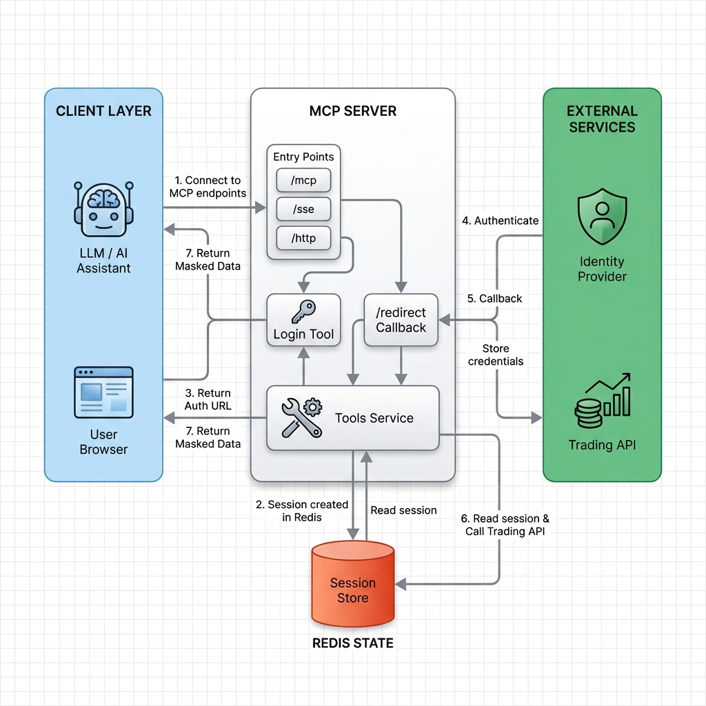
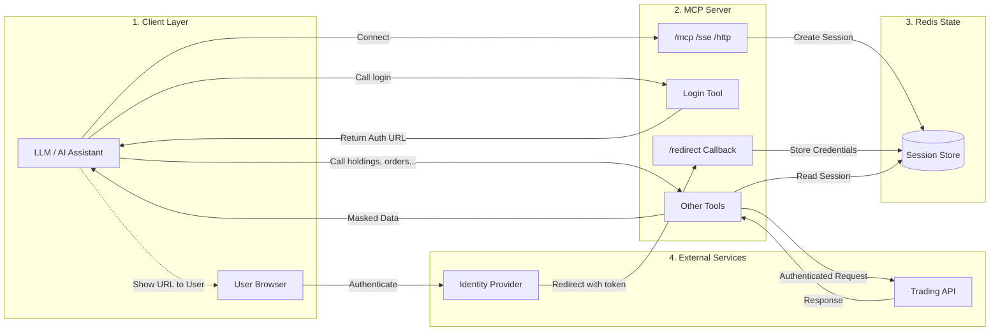

# MCP Server

An MCP Server (Model Context Protocol Server) is a standardized service that connects Large Language Models (LLMs) and AI agents to external data, tools, and applications (like Slack, GitHub, databases, or cloud services) using a common protocol, allowing the AI to perform real-world actions, retrieve live info, and integrate complex workflows beyond its training data. It acts as a translator, enabling AI to securely use APIs and internal systems, simplifying development and enabling more capable, agentic AI.

## Architecture

The **MCP** server employs a robust, layered architecture utilizing **FastMCP** on top of **Starlette** (ASGI), backed by **Redis** for stateful session management. It bridges stateless HTTP/SSE transports with stateful MCP sessions.

### Key Components

1.  **Core Server (FastMCP & Starlette)**
    *   **FastMCP**: Provides the high-level MCP protocol implementation.
    *   **Starlette**: Serves as the underlying ASGI framework, handling routing, middleware, and incoming HTTP requests.
    *   **Concurrency**: Uses `anyio` task groups to manage bidirectional streams and background tasks efficiently.

2.  **Custom Middleware**
    This component is the heart of the server, managing the lifecycle of every request:
    *   **Streamable HTTP Transport**: Implements the `StreamableHTTPServerTransport` to handle MCP messages over HTTP with full session awareness.
    *   **SSE Handlers**: Manages Server-Sent Events for real-time server-to-client communication. It utilizes `anyio.create_memory_object_stream` to create non-blocking, in-memory channels (`read_stream`, `write_stream`) for piping messages between the HTTP layer and the MCP core.
    *   **Session Context**: Injects `mcp_session_id` into request headers, allowing the stateless FastMCP server to operate as if it were stateful.

3.  **State Management (Redis)**
    All state is externalized to Redis, ensuring the application server remains stateless and horizontally scalable.
    *   **Session Logic**:
        *   **Structure**: Sessions are stored as JSON objects (`RedisJSON`).
        *   **Tracking**: Maintains `last_active` timestamps for accurate session expiry and cleanup.
        *   **Lifecycle**: Handles creation, validation, extension, and destruction of user sessions.
    *   **Auth Storage**:
        *   **Auth Codes**: Short-lived codes stored with a TTL.
        *   **Token Metadata**: `jti` (JWT ID) stored for revocation checks.

4.  **Security & Authentication**
    *   **OAuth 2.1 Implementation**: A custom, lightweight OAuth provider.
        *   **PKCE**: Enforces Proof Key for Code Exchange (S256) for secure public client authentication.
        *   **JWT Tokens**: Issues stateless Bearer tokens containing the `session_id`, signed with `HS256` (using `TOKEN_PARAMETER`).
    *   **Encryption**: Uses `cryptography` library (AES-CBC) to secure sensitive configuration data like Redis passwords.

5.  **Tools Service**
    *   Modular tool definitions that interact with external APIs.
    *   Uses `Helpers` and `SessionManager` to validate context before execution.

### Architecture Diagram



<details>
<summary>View as Text Diagram (Mermaid)</summary>



</details>

### Detailed Session & Authentication Workflow

The MCP server implements a specific state management flow to handle secure authentication and tool execution:

1.  **Session Management (Redis)**:
    *   The server uses Redis to manage user sessions with a default **1-hour activity window**.
    *   Redis acts as the central state store, allowing the stateless HTTP/SSE/MCP protocols to maintain context across requests.

2.  **Login Initiation (Tool-based)**:
    *   When a user needs to access protected resources (e.g., trading APIs), they typically start by calling the **`login` tool**.
    *   This tool generates a specific **Authentication URL** containing the necessary state parameters.
    *   The user is directed to visit this URL to authenticate with the external Broker/Identity Provider.

3.  **Authentication & Callback**:
    *   Upon successful authentication by the user on the external page, the Identity Provider triggers a **Callback**.
    *   This callback hits the MCP server's exposed **Redirect/Callback Endpoint**.
    *   The **Middleware** intercepts this callback, capturing the authentication tokens and parameters.

4.  **Session Hydration**:
    *   The captured credentials are **stored securely in Redis**, linked to the active `mcp_session_id`.
    *   This "hydrates" the session, elevating it from an anonymous state to an authenticated state.

5.  **Authorized Resource Access**:
    *   Subsequent calls to tools (like `holdings`, `orders`) verify the session in Redis.
    *   Since the session now contains the valid credentials (from step 4), the tools can successfully authenticate against the upstream Trading APIs.
    *   This seamless flow is supported across all transport layers: **`/mcp`** (Standard Protocol), **`/sse`** (Server-Sent Events), and **`/http`** (Direct HTTP).

### Authentication Flow for /http & /sse protocol (Deep Dive)

1.  **Authorization Request (`/authorize`)**:
    *   Client initiates flow with `code_challenge` and `redirect_uri`.
    *   Server generates a temporary `auth_code` stored in Redis (TTL: 10 mins).
    *   **No Credentials**: A session ID is created but remains unauthenticated regarding the broker.

2.  **Callback & Exchange (`/token`)**:
    *   Client presents `auth_code` and `code_verifier`.
    *   Server validates PKCE match (`SHA256(verifier) == challenge`).
    *   **Issue Token**: Returns a Signed JWT containing `session_id`.

3.  **Authenticated Interactions**:
    *   **HTTP**: Client sends `Authorization: Bearer <jwt>`. Middleware decodes JWT, extracts `session_id`, verifies it against Redis, and hydrates the request context.
    *   **SSE**: Client connects to `/sse?session_id=...`. The session is validated, and an async message pipeline is established.

## Quick Start

### Local Setup

1.  **Clone the repository**:
    ```bash
    git clone <repository-url>
    cd model-context-protocol
    ```

2.  **Set up Environment Variables**:
    Create a `.env` file based on your requirements.
    ```bash
    # Required for Encryption (Empty strings allow default behavior but providing keys is recommended)
    ENCRYPTION_KEY="your-32-byte-key"
    ENCRYPTION_IV="your-16-byte-iv"
    
    # Redis Configuration
    REDIS_HOST="localhost"
    REDIS_PORT=6379
    
    # App Config
    MASK_MCP_HOST="0.0.0.0"
    MASK_MCP_PORT=6901
    ```

3.  **Install Dependencies**:
    ```bash
    pip install -r requirements.txt
    ```

4.  **Run the Server**:
    ```bash
    python src/main.py
    ```

## Client Integration

### Claude Desktop Configuration

Add the following to your Claude Desktop configuration (`~/.config/Claude/claude_desktop_config.json`):

```json
{
  "mcpServers": {
    "mcp": {
      "command": "python",
      "args": ["/path/to/model-context-protocol/src/main.py"]
    }
  }
}
```

## Available Tools

- `service` - Generic service tool (Could be configured as required).

## Docker

### Building the Image

```bash
docker build -t mcp:1.0.0 .
```

### Running the Container

```bash
docker run -d --name mcp -p 6901:6901 mcp:1.0.0
```
