<div align="center">

# Model Context Protocol Template

**A production-ready template for building Model Context Protocol (MCP) pipelines that connect LLMs and AI agents to external data, tools, and services.**

[](https://python.org)
[](https://github.com/jlowin/fastmcp)
[](https://redis.io)
[](LICENSE)
[](Dockerfile)

</div>

---

## Table of Contents

- [Why MCP?](#-why-mcp)
- [Architecture Overview](#-architecture-overview)
  - [High-Level Pipeline Flow](#high-level-pipeline-flow)
  - [Detailed Component Architecture](#detailed-component-architecture)
  - [Authentication & Session Sequence](#authentication--session-sequence)
- [Key Components](#-key-components)
- [Tech Stack](#-tech-stack)
- [Project Structure](#-project-structure)
- [Getting Started](#-getting-started)
  - [Prerequisites](#prerequisites)
  - [Local Setup](#local-setup)
  - [Docker Deployment](#docker-deployment)
- [Client Integration](#-client-integration)
- [Available Tools](#-available-tools)
- [Configuration Reference](#-configuration-reference)
- [Session & Auth Deep Dive](#-session--auth-deep-dive)
- [Contributing](#-contributing)
- [License](#-license)

---

## Why MCP?

Large Language Models are powerful but isolated — they can't natively access live databases, trigger workflows, or call APIs. The **Model Context Protocol (MCP)** solves this by providing a **standardized bridge** between AI and the real world.

| Problem | MCP Solution |
|---|---|
| LLMs can't access live data | Connects to databases, APIs, and services in real-time |
| Every integration requires custom code | One universal protocol for all tool integrations |
| No session awareness across requests | Redis-backed stateful sessions over stateless HTTP/SSE |
| Security is an afterthought | Built-in OAuth 2.1 + PKCE, encrypted credentials, JWT tokens |
| Hard to scale AI tool servers | Stateless server design, horizontal scaling via externalized state |

This template gives you a **batteries-included starting point** — fork it, add your tools, and deploy.

---

## Architecture Overview


### High-Level Pipeline Flow

The MCP server acts as a **middleware pipeline** that translates between AI clients and external services. Below is the end-to-end data flow:

```mermaid
flowchart LR
    subgraph CLIENTS["👤 Client Layer"]
        LLM["🤖 LLM / AI Agent"]
        Browser["🌐 User Browser"]
    end

    subgraph MCP_SERVER["⚙️ MCP Server Pipeline"]
        direction TB
        Transport["Transport Layer<br/>/mcp · /sse · /http"]
        Middleware["Custom Middleware<br/>Session Injection · SSE Streams"]
        Core["FastMCP Core<br/>Protocol Handler · Tool Registry"]
        Tools["Tools Engine<br/>Modular Tool Execution"]
    end

    subgraph STATE["💾 State Layer"]
        Redis[("Redis<br/>Sessions · Auth · Tokens")]
    end

    subgraph EXTERNAL["🌍 External Services"]
        IDP["Identity Provider"]
        API["Upstream APIs"]
    end

    LLM -->|"MCP Request"| Transport
    Transport --> Middleware
    Middleware -->|"Read / Write"| Redis
    Middleware --> Core
    Core --> Tools
    Tools -->|"API Call"| API
    API -->|"Response"| Tools
    Tools -->|"Masked Data"| LLM
    Browser -->|"OAuth Login"| IDP
    IDP -->|"Callback + Token"| Middleware
    Middleware -->|"Store Credentials"| Redis

    style CLIENTS fill:#0d1b2a,stroke:#00b4d8,color:#e0e0e0
    style MCP_SERVER fill:#1a1a2e,stroke:#7b2ff7,color:#e0e0e0
    style STATE fill:#0d1b2a,stroke:#00c853,color:#e0e0e0
    style EXTERNAL fill:#0d1b2a,stroke:#ff6d00,color:#e0e0e0
```



> [!TIP]
> The server is **fully stateless** — all session data lives in Redis, making horizontal scaling trivial.

---

### Detailed Component Architecture

This diagram zooms into the internal layering of the MCP server, showing how each module connects:


---

### Authentication & Session Sequence

The following sequence diagram illustrates the complete lifecycle — from initial connection to authenticated tool execution:

```mermaid
sequenceDiagram
    participant LLM as 🤖 LLM / AI Agent
    participant MCP as ⚙️ MCP Server
    participant Redis as 💾 Redis
    participant Browser as 🌐 User Browser
    participant IDP as 🔑 Identity Provider
    participant API as 🌍 Upstream API

    Note over LLM,API: Phase 1 — Session Establishment
    LLM->>MCP: Connect via /mcp, /sse, or /http
    MCP->>Redis: Create session (JSON, 1hr TTL)
    Redis-->>MCP: session_id
    MCP-->>LLM: Connection established

    Note over LLM,API: Phase 2 — Authentication
    LLM->>MCP: Call "login" tool
    MCP-->>LLM: Return Auth URL
    LLM-->>Browser: Display Auth URL to user
    Browser->>IDP: User authenticates
    IDP->>MCP: Redirect callback with token
    MCP->>Redis: Store credentials → session_id
    Redis-->>MCP: OK
    MCP-->>Browser: "Login successful" page

    Note over LLM,API: Phase 3 — Authenticated Tool Execution
    LLM->>MCP: Call tool (e.g., "service")
    MCP->>Redis: Validate session + load credentials
    Redis-->>MCP: Session data + credentials
    MCP->>API: Authenticated API request
    API-->>MCP: Response data
    MCP-->>LLM: Masked / formatted result
```



---

## Key Components

| Component | Description |
|---|---|
| **FastMCP Core** | High-level MCP protocol implementation — tool registration, message routing, context management |
| **Starlette (ASGI)** | Underlying async web framework — handles HTTP routing, middleware stack, and request lifecycle |
| **Custom Middleware** | Session-aware request handler — injects `mcp_session_id`, manages SSE streams via `anyio` memory channels, bridges HTTP ↔ MCP |
| **OAuth 2.1 + PKCE** | Lightweight built-in authorization server — issues JWT Bearer tokens, enforces S256 PKCE for public clients |
| **Redis State Store** | Externalized session & auth storage — `RedisJSON` objects with TTL, auth codes, and token metadata |
| **AES-CBC Encryption** | Protects sensitive configuration values (e.g., Redis passwords) using the `cryptography` library |
| **Tools Engine** | Modular tool definitions — validates context via `Helpers` and `SessionManager` before executing business logic |
| **Structured Logging** | Uses `structlog` for JSON-formatted structured logs with configurable log levels |

---

## Tech Stack

| Layer | Technology | Purpose |
|---|---|---|
| **Runtime** | Python 3.13 | Core language |
| **MCP Protocol** | FastMCP | Protocol implementation & tool registry |
| **Web Framework** | Starlette (ASGI) | HTTP/SSE routing & middleware |
| **ASGI Server** | Uvicorn | High-performance async server |
| **State Store** | Redis (RedisJSON) | Sessions, auth codes, token metadata |
| **Authentication** | Custom OAuth 2.1 | PKCE, JWT, Bearer tokens |
| **Encryption** | `cryptography` (AES-CBC) | Config & credential protection |
| **Logging** | `structlog` | Structured JSON logging |
| **Containerization** | Docker (Alpine) | Lightweight deployment |
| **Async** | `anyio` | Task groups & memory streams |

---

## 📁 Project Structure

```
model-context-protocol/
├── src/
│   ├── main.py                 # Application entry point & tool registration
│   ├── config.py               # Environment loading & configuration constants
│   ├── auth/
│   │   ├── oauth.py            # OAuth 2.1 authorization server (PKCE)
│   │   └── token.py            # JWT token issuance & validation
│   ├── conn/
│   │   └── redis_config.py     # Redis client initialization
│   ├── encryptdecrypt/
│   │   └── encrypt.py          # AES-CBC encryption / decryption utilities
│   ├── exception/
│   │   └── handler.py          # Global exception handling
│   ├── log/
│   │   └── logger.py           # Structured logging configuration
│   ├── middleware/
│   │   └── middleware.py        # Custom middleware (session injection, SSE, transport)
│   ├── server/
│   │   └── server.py           # Starlette app factory & route definitions
│   ├── session/
│   │   ├── manager.py          # Session lifecycle management (Redis)
│   │   └── session.py          # Session model & validation
│   ├── tools/
│   │   └── service.py          # Modular tool definitions
│   └── utils/
│       └── helpers.py          # Context validation & utility functions
├── docs/
│   └── architecture_diagram.png
├── test/                       # Unit & integration tests
├── .env                        # Environment variables (not committed)
├── Dockerfile                  # Container image definition
├── pyproject.toml              # Pytest & coverage configuration
├── requirements.txt            # Python dependencies
└── LICENSE                     # MIT License
```

---

## Getting Started

### Prerequisites

| Requirement | Version |
|---|---|
| Python | ≥ 3.13 |
| Redis | ≥ 7.0 (with RedisJSON module) |
| Docker | ≥ 20.10 *(optional, for containerized deployment)* |

### Local Setup

**1. Clone the repository**

```bash
git clone https://github.com/shubhamauti9/model-context-protocol.git
cd model-context-protocol
```

**2. Create a virtual environment**

```bash
python -m venv .venv
source .venv/bin/activate        # macOS / Linux
.venv\Scripts\activate           # Windows
```

**3. Install dependencies**

```bash
pip install -r requirements.txt
```

**4. Configure environment variables**

Create a `.env` file in the project root:

```env
# ── App ──────────────────────────────────
MASK_MCP_HOST=0.0.0.0
MASK_MCP_PORT=6901
APP_VERSION=1.0.0

# ── Redis ────────────────────────────────
REDIS_HOST=localhost
REDIS_PORT=6379
REDIS_P=                         # Redis password (leave blank for local)
REDIS_DB=0

# ── Encryption ───────────────────────────
ENCRYPTION_KEY=your-32-byte-key
ENCRYPTION_IV=your-16-byte-iv

# ── Logging ──────────────────────────────
LOG_FILE=logs/mcp.log
```

**5. Start Redis**

```bash
# Using Docker
docker run -d --name redis -p 6379:6379 redis:7-alpine

# Or install natively 
visit https://redis.io/docs/getting-started/
```

**6. Run the server**

```bash
python src/main.py
```

The server will start at `http://0.0.0.0:6901`. You can verify it's running:

```bash
curl http://localhost:6901/mcp
```

---

### Docker Deployment

**Build the image**

```bash
docker build -t mcp:1.0.0 .
```

**Run the container**

```bash
docker run -d \
  --name mcp-server \
  -p 6901:6901 \
  --env-file .env \
  mcp:1.0.0
```

**Docker Compose** *(recommended for production)*

```yaml
version: "3.9"
services:
  redis:
    image: redis:7-alpine
    ports:
      - "6379:6379"
  mcp:
    build: .
    ports:
      - "6901:6901"
    depends_on:
      - redis
    env_file:
      - .env
```

---

## 🔗 Client Integration

### Claude Desktop

Add the following to your Claude Desktop configuration file:

| OS | Config Path |
|---|---|
| macOS | `~/.config/Claude/claude_desktop_config.json` |
| Windows | `%APPDATA%\Claude\claude_desktop_config.json` |

```json
{
  "mcpServers": {
    "mcp": {
      "command": "python",
      "args": ["/path/to/model-context-protocol/src/main.py"]
    }
  }
}
```

### Direct HTTP

```bash
# Connect over HTTP
curl -X POST http://localhost:6901/http \
  -H "Content-Type: application/json" \
  -d '{"method": "tools/call", "params": {"name": "service"}}'
```

### SSE (Server-Sent Events)

```bash
# Open an SSE stream
curl -N http://localhost:6901/sse?session_id=<your-session-id>
```

---

## Available Tools

| Tool | Description |
|---|---|
| `service` | Generic, modular service tool — designed to be extended for your specific use case. Validates session context before execution. |

> [!NOTE]
> To add custom tools, create a new module in `src/tools/`, define your tool function, and register it in `src/main.py` using the `@mcp.tool()` decorator. See `src/tools/service.py` for a reference implementation.

---

## ⚙️ Configuration Reference

| Variable | Required | Default | Description |
|---|---|---|---|
| `MASK_MCP_HOST` | Yes | — | Server bind address |
| `MASK_MCP_PORT` | No | `6901` | Server port |
| `APP_VERSION` | No | — | Application version string |
| `REDIS_HOST` | Yes | `127.0.0.1` | Redis server hostname |
| `REDIS_PORT` | No | `6379` | Redis server port |
| `REDIS_P` | No | `""` | Redis password |
| `REDIS_DB` | No | `0` | Redis database index |
| `ENCRYPTION_KEY` | Yes | — | 32-byte AES encryption key |
| `ENCRYPTION_IV` | Yes | — | 16-byte AES initialization vector |
| `LOG_FILE` | No | — | Log file output path |

---

## 🔐 Session & Auth Deep Dive

### Session Lifecycle

```
┌─────────────┐     ┌──────────────┐      ┌──────────────┐     ┌─────────────┐
│   CONNECT   │────▶│   ANONYMOUS  │────▶│ AUTHENTICATED│────▶│   EXPIRED   │
│             │     │  Session in  │      │ Credentials  │     │  TTL reached│
│  /mcp /sse  │     │  Redis (1hr) │      │ stored in    │     │  or manual  │
│  /http      │     │              │      │  Redis       │     │  logout     │
└─────────────┘     └──────────────┘      └──────────────┘     └─────────────┘
```

### OAuth 2.1 + PKCE Flow (for `/http` & `/sse`)

1. **Authorization** — Client sends `code_challenge` + `redirect_uri` to `/authorize`. Server creates a temporary `auth_code` in Redis (10-min TTL).
2. **Token Exchange** — Client presents `auth_code` + `code_verifier` to `/token`. Server validates `SHA256(verifier) == challenge`, then issues a signed JWT containing the `session_id`.
3. **Authenticated Requests**:
   - **HTTP**: `Authorization: Bearer <jwt>` → Middleware decodes JWT, extracts `session_id`, validates against Redis.
   - **SSE**: `/sse?session_id=...` → Session validated, async message pipeline established.

### Transport Protocols

| Protocol | Endpoint | Use Case | Session |
|---|---|---|---|
| **MCP** | `/mcp` | Standard MCP clients (Claude, etc.) | Auto-managed |
| **SSE** | `/sse` | Real-time streaming responses | Query param |
| **HTTP** | `/http` | REST-style direct calls | Bearer JWT |

---

## 🤝 Contributing

Contributions are welcome! Here's how to get started:

1. **Fork** the repository
2. **Create** a feature branch: `git checkout -b feature/my-tool`
3. **Commit** your changes: `git commit -m "feat: add my-tool integration"`
4. **Push** to the branch: `git push origin feature/my-tool`
5. **Open** a Pull Request

> [!IMPORTANT]
> Please ensure your code passes the existing test suite before submitting a PR:
> ```bash
> pytest --cov=src --cov-report=term-missing
> ```

---

## 📄 License

This project is licensed under the **MIT License** — see the [LICENSE](LICENSE) file for details.

---
